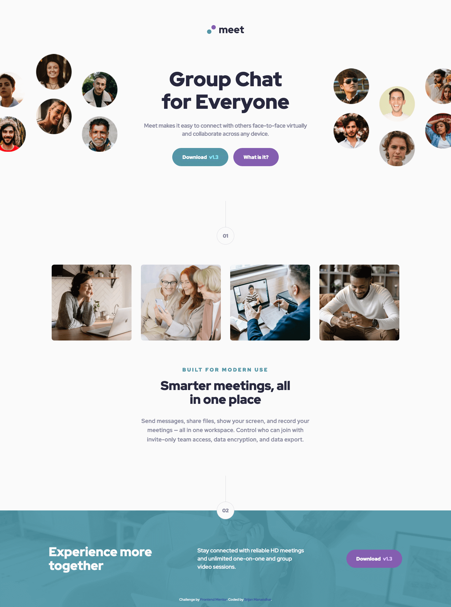

# Frontend Mentor - Meet landing page solution

This is a solution to the [Meet landing page challenge on Frontend Mentor](https://www.frontendmentor.io/challenges/meet-landing-page-rbTDS6OUR). Frontend Mentor challenges help you improve your coding skills by building realistic projects.

## Table of contents

- [Overview](#overview)
  - [The challenge](#the-challenge)
  - [Screenshot](#screenshot)
  - [Links](#links)
- [My process](#my-process)
  - [Built with](#built-with)
  - [What I learned](#what-i-learned)
  - [Useful resources](#useful-resources)
- [Author](#author)

## Overview

### The challenge

Users should be able to:

- View the optimal layout depending on their device's screen size
- See hover states for interactive elements

### Screenshot



### Links

- Solution URL: [https://github.com/srijanss/meet-landing-page](https://github.com/srijanss/meet-landing-page)
- Live Site URL: [https://srijanss.github.io/meet-landing-page/](https://srijanss.github.io/meet-landing-page/)

## My process

### Built with

- Semantic HTML5 markup
- CSS custom properties
- Flexbox
- CSS Grid
- Mobile-first workflow
- [Vite](https://vitejs.dev/) - Lightweight frontend tooling
- [PostCSS](https://postcss.org/) - Tool to transform CSS using plugins

### What I learned

```css
img {
  max-inline-size: 100%;
  object-fit: cover;
  object-position: center;
}
.hero {
  @mixin full-width;
  margin: 64px auto 0;
  display: grid;
  justify-content: center;

  & img.hero__image--left {
    display: block;
    width: 414px;
    height: 153px;
  }
  & img.hero__image--right {
    display: none;
  }
  @mixin media-query-tablet {
    margin: 64px auto 0;

    & img.hero__image--left {
      width: 820px;
      height: 303px;
    }
  }
  @mixin media-query-desktop {
    max-width: 100%;
    width: 1504px;
    height: 358px;
    margin: 64px auto 0;
    grid-template-columns: repeat(3, 1fr);
    gap: 24px;
    & img.hero__image--left {
      width: 375px;
      height: 312px;
      justify-self: start;
      object-position: right;
      @mixin media-query-desktop-xl {
        width: auto;
        height: auto;
      }
    }
    & img.hero__image--right {
      display: block;
      height: 312px;
      object-position: left;
      justify-self: end;
      align-self: end;
      @mixin media-query-desktop-xl {
        width: auto;
        height: auto;
      }
    }
  }
}
```

I got to learn about object-fit, object-position, block-size property for images. It helped me a lot to layout images and match the design for all the layouts.

```css
footer {
  & .step {
    position: relative;
    top: calc(var(--step-bubble-size) / 2);
    left: calc(50% - var(--step-bubble-size) / 2);
    z-index: 1;
    @mixin media-query-desktop {
      margin-top: calc(var(--step-bubble-tail-length) + 72px);
    }
  }
  & .cta {
    position: relative;
    z-index: 0;
  }
  & section {
    position: absolute;
    top: 0;
    left: 0;
    @mixin full-width-height;
    background-color: var(--primary-color-90);
    display: flex;
    flex-direction: column;
    justify-content: center;
    align-items: center;
    gap: 32px;
    color: var(--off-white);
    text-align: center;
    padding: 0 24px;
    ...;
  }
  & img {
    display: block;
    width: 100%;
    block-size: auto;
  }
  ...;
}
```

I also got to learn about how setting position: relative on one parent element helps to get the size for absolute positioned children element. In above css, I have to get the width and height of footer based on the image. And I've set the size of the section element relative to image size, and transparent green background was applied to section. This way I was able to match all the layouts.

I had hard time figuring out how to lay the hero and footer image. In the hero image I tried different things,

- I use transform scale, translateX to move the images in hero section
- It worked fine, but in CSS I have to add lots of calc() functions and tweak to pixels to match the design. I since I used scaling it messed up with the horizontal size, so I have to use overflow-x hidden.
- So, I had to redo it using object-fit and object-position property. And it fixed the overflow issue and I didn't have to tweak the pixels to make it work.
- And then the footer image messed up. I've used object-fit to cover, so the image zoomed up. Then I found another solution to use block-size to fit the image aspect ratio.

### Useful resources

- [Responsive images](https://web.dev/learn/design/responsive-images) - This helped me for understading object-fit, block-size property and laying out images in hero section and footer.

## Author

- Website - [Srijan Manandhar](https://github.com/srijanss)
- Frontend Mentor - [@srijanss](https://www.frontendmentor.io/profile/srijanss)
